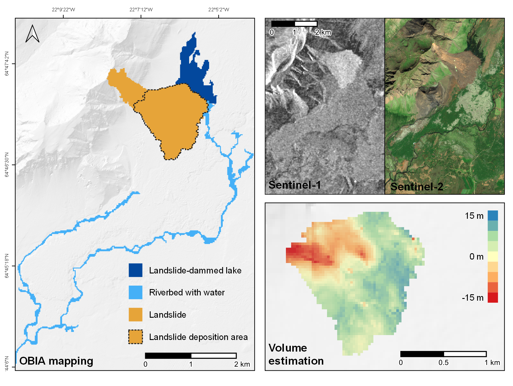
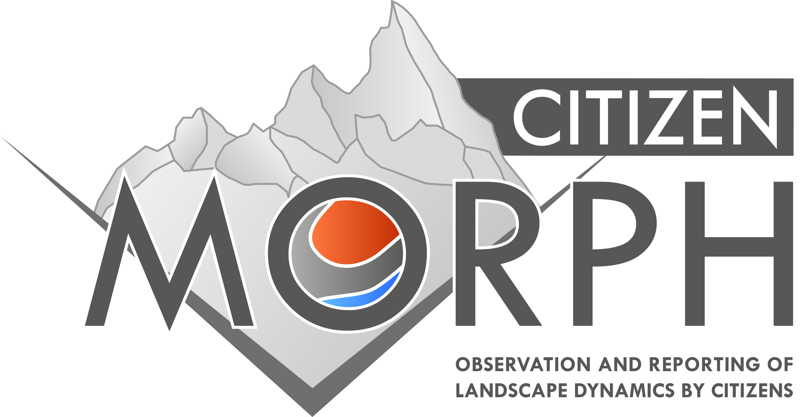
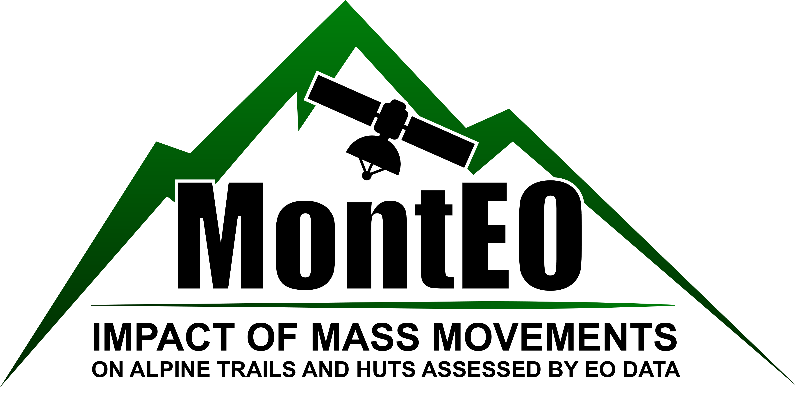
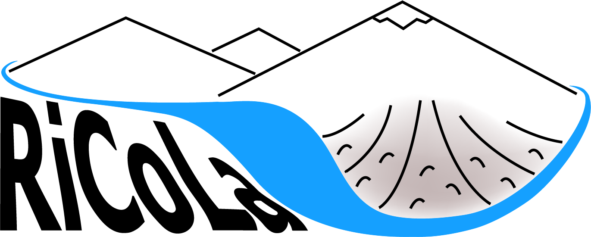
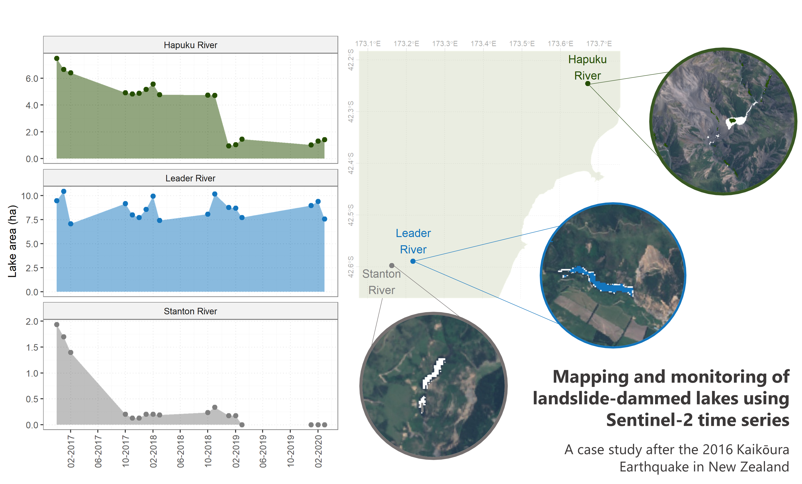
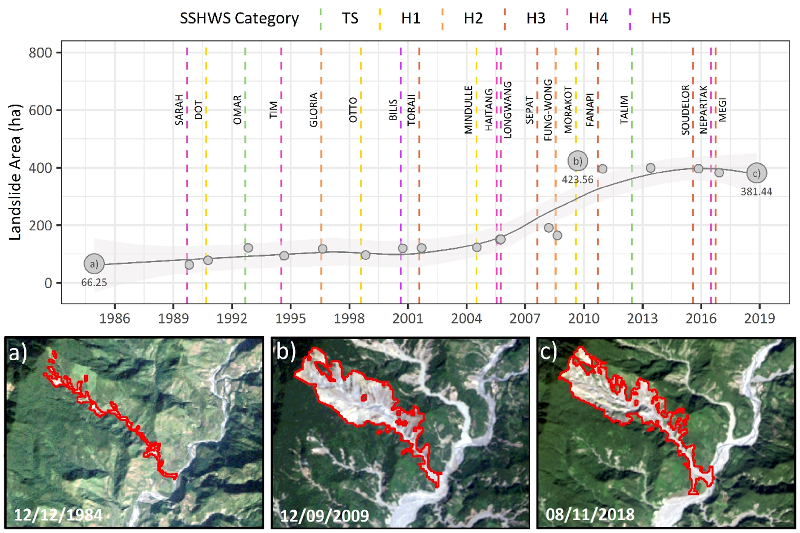

class: left, middle

```{r setup, include=FALSE}
options(htmltools.dir.version = FALSE)
```

```{r xaringan-themer, include=FALSE}
library(xaringanthemer)
style_duo_accent(
  primary_color = '#278086', secondary_color = '#c3d0e3',
  title_slide_text_color = '#ffffff',
  header_font_google = google_font("Roboto", "400"),
  text_font_google   = google_font("Nunito", "400", "400i"),
  code_font_google   = google_font("IBM Plex Mono"), 
  inverse_header_color = '#ffffff', inverse_text_color = "#ffffff", inverse_text_shadow = T, 
  # link_color = "#ccedf0",
  extra_css = list(
    ".pull-left-70" = list("float" = "left", "width" = "65.8%"),
    ".pull-right-30" = list("float" = "right", "width" = "28.2%"),
    ".pull-left-30" = list("float" = "left", "width" = "28.2%"),
    ".pull-right-70" = list("float" = "right", "width" = "65.8%"),
    ".pull-left-80" = list("float" = "left", "width" = "77%"),
    ".pull-right-20" = list("float" = "right", "width" = "18.8%"),
    ".pull-left-20" = list("float" = "left", "width" = "18.8%"),
    ".pull-right-80" = list("float" = "right", "width" = "77%"),
    # ".orange" = list("color" = "#ffa500"),
    ".note" = list("font-size" = "0.5em", "position" = "absolute", 
      "bottom" = "15px", "padding-right" = "4em"),
    ".logo-left" = list("top" = "2%", "left" = "2%", "position" = "absolute", "width" = "200px"),
    ".logo-right" = list("top" = "2%", "left" = "72%", "position" = "absolute", "width" = "270px"),
    ".title-slide h1" = list("font-size" = "190%"),
    ".title-slide h2" = list("font-size" = "140%"),
    ".title-slide h3" = list("font-size" = "100%"),
    ".opacity" = list("opacity" = "0.2"),
    ".content-box-grey" = list("box-sizing" = "content-box", "padding" = "10px", "background-color" = "rgba(236, 236, 236, 0.2)")
  )
)
```


# Contenido

1. Conceptos clave
2. 


---
class: inverse left bottom
background-image: url(figs/geoscience_for_the_future_spa.png)
background-position: 100% 0%
background-size: contain


.note[Fuente: [The Geological Society](https://www.geolsoc.org.uk/Posters)]

---
class: inverse, left, top
background-image: url(figs/is_landslide.JPG)
background-size: cover

.logo-right[[](http://morph.zgis.at/)]


.pull-left[

&nbsp;

&nbsp;

&nbsp;

&nbsp;

&nbsp;

&nbsp;

.content-box-grey[
Mapeo de taludes inestables y depósitos volcánicos con interferometría SAR

Análisis de series de tiempo para el monitoreo de la evolución de la superficie terrestre

Área de estudio: Islandia

.note[Foto: Jon Gudlaugur Gudbrandsson]
]]
--

.pull-right[

&nbsp;

&nbsp;

&nbsp;



.right[[Link](https://doi.org/10.3390/app10175848) al artículo]

]

???
Mapeo, monitoreo y modelado de la dinámica espacio-temporal de la morfología de la superficie terrestre

---
class: inverse, left, top
background-image: url(figs/is_shoreline.JPG)
background-size: cover

.logo-right[[](http://citizenmorph.sbg.ac.at/)]

.pull-left-30[

&nbsp;

&nbsp;

.content-box-grey[
Proyecto de ciencia ciudadana

Colección de datos (espaciales) de accidentes geográficos

Para participar sigan los pasos [**aquí**](http://citizenmorph.sbg.ac.at/mitmachen/wie-mitmachen-2/)
]
.note[Foto: Lorena Abad Crespo]

]
--
.pull-right-70[

&nbsp;

&nbsp;

&nbsp;

<iframe width="500" height="400" frameborder="0" seamless src="https://p3d.in/e/XzOH7+load"></iframe>
]

---
class: inverse, left, top
background-image: url(figs/at_scree.JPG)
background-size: cover

.logo-right[[](https://monteo.zgis.at/)]

.pull-left-30[

&nbsp;

&nbsp;

.content-box-grey[
Mapeo de deslizamientos y evaluación de riesgos basado en imágenes satelitales

Enfoque en infrastructura alpina (senderos y cabañas)

Productos finales: mapas regionales de susceptibilidad a deslizamientos 

Área de estudio: Alpes austriacos
]
.note[Foto: Lorena Abad Crespo]

]

---
class: inverse, left, top
background-image: url(figs/nz_dammedlake.jpg)
background-size: cover

.logo-left[[](https://landslides-and-rivers.sbg.ac.at/)]


.pull-left[

&nbsp;

&nbsp;

&nbsp;

.content-box-grey[
Evaluación de cambios de cursos de ríos y formación de represas debido a deslizamientos 

Análisis del riesgo de inundaciones por ruptura de presas

Monitoreo de eventos extremos y su interacción con sistemas hídricos

Área de estudio: Taiwan, Nueva Zelanda, Alpes Europeos
]

.note[Foto: James Thompson - Environment Canterbury]

]

--
.pull-right-30[



.right[[Link](https://meetingorganizer.copernicus.org/EGU2020/EGU2020-572.html) a las memorias del EGU2020]



.right[[Link](https://doi.org/10.3390/app10020630) al artículo]

]

---
class: inverse, left, top
background-image: url(figs/nz_earthflow.jpg)
background-size: cover

---

class: center, middle

# Gracias!

¿Preguntas? 

Contacto: [**lorenacristina.abadcrespo@sbg.ac.at**](mailto:lorenacristina.abadcrespo@sbg.ac.at)

Diapositivas creadas con el paquete [**xaringan**](https://github.com/yihui/xaringan) de R.