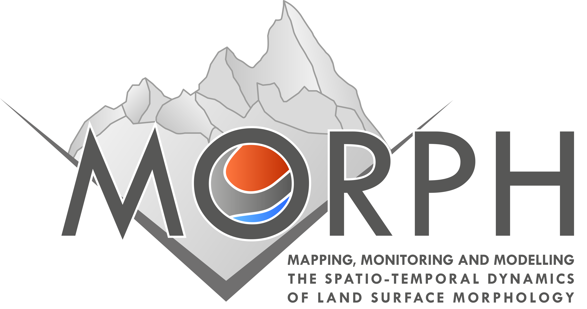

class: left, middle

```{r setup, include=FALSE}
options(htmltools.dir.version = FALSE)
```

```{r xaringan-themer, include=FALSE}
color1 = '#278086'
color2 = '#c3d0e3'
library(xaringanthemer)
style_duo_accent(
  primary_color = color1, secondary_color = color2,
  title_slide_text_color = "#000000",
  header_font_google = google_font("Roboto", "400"),
  text_font_google   = google_font("Nunito", "400", "400i"),
  code_font_google   = google_font("IBM Plex Mono"), 
  inverse_header_color = '#ffffff', inverse_text_color = "#ffffff", inverse_text_shadow = T, inverse_background_color = color1,
  title_slide_background_image = "figs/riococaSWIR_BW.jpg",
  title_slide_background_position = c("0%", "0%"),
  # link_color = "#ccedf0",
  extra_css = list(
    ".pull-left-70" = list("float" = "left", "width" = "65.8%"),
    ".pull-right-30" = list("float" = "right", "width" = "28.2%"),
    ".pull-left-30" = list("float" = "left", "width" = "28.2%"),
    ".pull-right-70" = list("float" = "right", "width" = "65.8%"),
    ".pull-left-80" = list("float" = "left", "width" = "77%"),
    ".pull-right-20" = list("float" = "right", "width" = "18.8%"),
    ".pull-left-20" = list("float" = "left", "width" = "18.8%"),
    ".pull-right-80" = list("float" = "right", "width" = "77%"),
    # ".inverse_link_color" = list("color" = "#defbff"),
    ".note" = list("font-size" = "0.5em", "position" = "absolute", 
      "bottom" = "15px", "padding-right" = "4em"),
    ".logo-left" = list("top" = "2%", "left" = "2%", "position" = "absolute", "width" = "200px"),
    ".logo-right" = list("top" = "2%", "left" = "72%", "position" = "absolute", "width" = "270px"),
    ".title-slide h1" = list("font-size" = "190%"),
    ".title-slide h2" = list("font-size" = "140%"),
    ".title-slide h3" = list("font-size" = "100%"),
    ".opacity" = list("opacity" = "0.2"),
    ".content-box-grey" = list("box-sizing" = "content-box", "padding" = "10px", "background-color" = "rgba(236, 236, 236, 0.4)")
  )
)
```

```{r deathrate, echo = F, message = F, warning = F}
library(tidyr)
library(dplyr)
disasters = read.csv('data/number-of-natural-disaster-events.csv')
names(disasters) = c('entity', 'year', 'number')

disasters_wrangle = disasters %>% 
  filter(entity != "Impact") %>% 
  pivot_wider(names_from = entity, values_from = number) %>% 
  rowwise() %>% 
  mutate(Landslides = sum(Landslide,`Mass movement (dry)`, na.rm = T)) %>% 
  select(-Landslide, -`Mass movement (dry)`) %>% 
  rename(
    "Acumulado" = `All natural disasters`, 
    "Sequía" = Drought,
    "Terremoto" = Earthquake,
    "Temp. extrema" = `Extreme temperature`,
    "Clima extremo" = `Extreme weather`,
    "Inundaciones" = Flood,
    "Deslizamientos" = Landslides, 
    "Actividad volcánica" = `Volcanic activity`,
    "Incendios" = Wildfire
  ) %>% 
  pivot_longer(-year, names_to = 'entity', values_to = 'number') %>% 
  arrange(year, entity)

library(ggplot2)
library(gganimate)
g = ggplot(disasters_wrangle, aes(y = number, x = year)) +
  geom_area(
    data = disasters_wrangle %>% filter(entity == "Acumulado"),
    aes(color = entity), fill = 'grey70', alpha = 0.3, color = NA
  ) +
  geom_line(
    data = disasters_wrangle %>% filter(entity != "Acumulado"), 
    aes(color = entity), size = 0.75, show.legend = T
  ) +
  
  scale_x_continuous(limits = c(1900,2021), expand = c(0,0), n.breaks = 13) +
  ggthemes::scale_color_colorblind("") + 
  transition_reveal(year) +
  view_follow(fixed_x = T) +
  labs(
    title = "Peligros naturales",
    subtitle = "No. de eventos desde 1900 al 2019",
    caption = "Gráfico modificado de ourworldindata.org.\nFuente: EMDAT (2020): OFDA/CRED International Disaster Database,\nUniversité catholique de Louvain – Brussels – Belgium",
    x = '', y = '') +
  theme_xaringan()
```

```{r, cache = T, echo = F, fig.align = 'center', fig.width = 15, fig.height = 8, warning= F, message = F, gganimate = list(duration = 20, start_pause = 5, end_pause = 50)}
g
```

---
class: center

.pull-left[
## Peligros naturales

.left[
- Fenómenos naturales
- Eventos inesperados y/o incontrolables
- Con efectos *negativos* para el **medio ambiente**

.note[Fuente y más info: [nonaturaldisasters.com](https://www.nonaturaldisasters.com/), Infografía: <a href='https://www.freepik.com/vectors/map'>Map vector created by macrovector - www.freepik.com</a>]
]


]

.pull-right[
## Desastres

.left[
- Disrupción del funcionamiento de una comunidad o sociedad
- **Evento peligroso + exposición + vulnerabilidad**
- Mal llamados "desastres naturales"
]

[](https://www.nonaturaldisasters.com/)
]


**"Los peligros naturales son inevitables, el impacto que tienen en la sociedad no lo es."**

---
class: left top
background-image: url(figs/geoscience_for_the_future_spa.png)
background-position: 100% 0%
background-size: contain

### ¿Qué <br> podemos <br> hacer?

.note[Fuente: [The Geological Society](https://www.geolsoc.org.uk/Posters)]

---
class: center, middle, inverse
background-image: url(https://images.unsplash.com/photo-1451187580459-43490279c0fa?ixlib=rb-1.2.1&ixid=eyJhcHBfaWQiOjEyMDd9)
background-size: cover

.left[.note[Foto: [unsplash.com](https://unsplash.com/)]]

## Sistemas de información geográfica y percepción remota

--
### ó

## Tecnologías geoespaciales


---
class: top, center
background-image: url(https://pixnio.com/free-images/2019/11/28/2019-11-28-14-04-21-1200x800.jpg)
background-size: cover

.left[.note[Foto: Photo by <a href="https://pixnio.com/media/geography-location-map-paper-document"> Bicanski</a> on <a href="https://pixnio.com/">Pixnio</a>]]

### ¿Cuál es su rol?

--

Manejo de bases de datos geoespaciales

--

Análisis de datos

--

Planificación del territorio y recursos

--

Herramientas para toma de decisiones 

---
class: middle, center
background-image: url(figs/landslides.jpg)
background-size: cover

.left[.note[Foto: Distribución global de deslizamientos. Datos de [Froude and Petley (2018).](https://nhess.copernicus.org/articles/18/2161/2018/)]]

## Datos geoespaciales

--

### `r anicon::faa('exclamation', animate = 'bounce', ltext = 'Big Data  ')`

--

.left[
.pull-left[

### Datos vectoriales

- Inventario de eventos (puntos, polígonos)
  - Inventarios oficiales
  - Crowdsourcing (colaboración masiva voluntaria)
- Información auxiliar: 
    - Uso de suelo / cobertura de suelo
    - Geología
    - Información hidrológica
]]

--

.left[
.pull-right[

### Datos raster

- Imágenes satelitales
  - Landsat, Sentinel, PlanetScope, RapidEye
  - Sensores ópticos, radar, espectrómetros, mediciones atmosféricas
- Fotografías aéreas (UAV)
- LiDaR
- Modelos digitales de elevación (DEM)
]]

---
class: center, middle

## Herramientas y tecnologías

--

.pull-left[

### Software proprietario


]

--

.pull-right[

### Software abierto


]

--

¡El uso de software abierto fomenta la **investigación reproducible**!

---
class: center, middle, inverse
background-image: url(figs/obia.jpg)
background-size: cover

.note[Foto: Daniel Hölbling] 

## Análisis de datos

Digitalización

Clasificación automática de imágenes

---
class: center, middle, inverse
background-image: url(figs/obia.jpg)
background-size: cover

.note[Foto: Daniel Hölbling]

## Aplicaciones

`r anicon::faa('map', animate = 'pulse', rtext = "  Mapeo y monitoreo de peligros naturales")` 

`r anicon::faa('search', animate = 'pulse', rtext = "  Análisis de vulnerabilidad y riesgos")` 

...

--

### Proyectos de investigación

Enfoque en deslizamientos de tierra y peligros asociados

---
class: inverse, left, top
background-image: url(figs/is_landslide.JPG)
background-size: cover

.logo-right[[](http://morph.zgis.at/)]


.pull-left[

&nbsp;

&nbsp;

&nbsp;

&nbsp;

&nbsp;

&nbsp;

.content-box-grey[
Mapeo de taludes inestables y depósitos volcánicos con interferometría SAR

Análisis de series de tiempo para el monitoreo de la evolución de la superficie terrestre

Área de estudio: Islandia

.note[Foto: Jon Gudlaugur Gudbrandsson]
]]
--

.pull-right[

&nbsp;

&nbsp;

&nbsp;


.right[[Link](https://doi.org/10.3390/app10175848) al artículo]

]

???
Mapeo, monitoreo y modelado de la dinámica espacio-temporal de la morfología de la superficie terrestre

---
class: inverse, left, top
background-image: url(figs/is_shoreline.JPG)
background-size: cover

.logo-right[[](http://citizenmorph.sbg.ac.at/)]

.pull-left-30[

&nbsp;

&nbsp;

.content-box-grey[
Proyecto de ciencia ciudadana

Colección de datos (espaciales) de accidentes geográficos

Para participar sigan los pasos [**aquí**](http://citizenmorph.sbg.ac.at/mitmachen/wie-mitmachen-2/)
]
.note[Foto: Lorena Abad Crespo]

]

---
class: inverse, left, top
background-image: url(figs/at_scree.jpg)
background-size: cover

.logo-right[[](https://monteo.zgis.at/)]

.pull-left-30[

&nbsp;

&nbsp;

.content-box-grey[
Mapeo de deslizamientos y evaluación de riesgos basado en imágenes satelitales

Enfoque en infrastructura alpina (senderos y cabañas)

Productos finales: mapas regionales de susceptibilidad a deslizamientos 

Área de estudio: Alpes austriacos
]
.note[Foto: Lorena Abad Crespo]

]

---
class: inverse, left, top
background-image: url(figs/nz_dammedlake.jpg)
background-size: cover

.logo-left[[](https://landslides-and-rivers.sbg.ac.at/)]


.pull-left[

&nbsp;

&nbsp;

&nbsp;

.content-box-grey[
Evaluación de cambios de cursos de ríos y formación de represas debido a deslizamientos 

Análisis del riesgo de inundaciones por ruptura de presas

Monitoreo de eventos extremos y su interacción con sistemas hídricos

Área de estudio: Taiwan, Nueva Zelanda, Alpes Europeos
]

.note[Foto: James Thompson - Environment Canterbury]

]

--
.pull-right-30[


.right[[Link](https://meetingorganizer.copernicus.org/EGU2020/EGU2020-572.html) a las memorias del EGU2020]


.right[[Link](https://doi.org/10.3390/app10020630) al artículo]

]

---
class: inverse, right, top
background-image: url(figs/nz_earthflow.JPG)
background-size: cover

## [STEC](https://www.landcareresearch.co.nz/discover-our-research/land/erosion-and-sediment/smarter-targeting-of-erosion-control/)
### Smarter Targeting of Erosion Control 

.left[.note[Foto: Lorena Abad Crespo]]

.pull-right[
.content-box-grey[
Patrones espacio-temporales de erosión

Calidad de agua (sedimentos)

Mitigación de erosión y sedimentos (aspectos ambientales y económicos)

Área de estudio: Nueva Zelanda
]

]

---

class: center, middle, inverse
background-image: url(figs/riococaTC.jpg)
background-position: 0% 0%
background-size: cover

# ¡Gracias por su atención!

¿Preguntas? 

Contacto: 

`r anicon::faa("envelope", color = color2, animate="wrench", anitype="parent-hover",rtext = "    [**lorenacristina.abadcrespo@sbg.ac.at**](mailto:lorenacristina.abadcrespo@sbg.ac.at)")`

`r anicon::faa("twitter", color = color2, animate="wrench", anitype="parent-hover",rtext = "    [**@loreabad6**](https://twitter.com/loreabad6)") `

.left[.footnote[Diapositivas creadas con los paquetes [**xaringan**](https://github.com/yihui/xaringan) y [**xaringanthemer**](https://github.com/gadenbuie/xaringanthemer) de R. <br>
Repositorio de la presentación: [aquí](https://github.com/loreabad6/VocesAmbiental/)]]

.note[Foto: Erosión regresiva Río Coca,<br>Sentinel-2, RGB: B4-B3-B2, 24/08/2020]